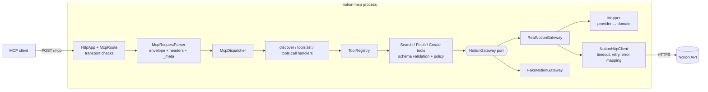
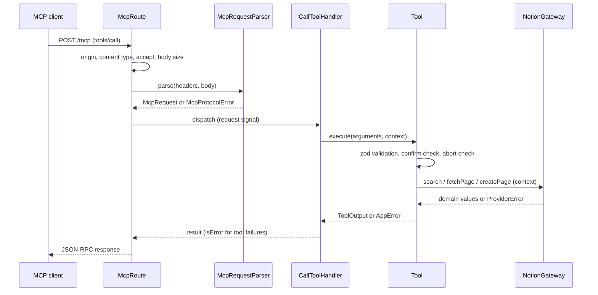

# Notion MCP Server

A small, readable [Model Context Protocol](https://modelcontextprotocol.io) server that lets AI
agents search, read and (with explicit confirmation) create pages in Notion. It speaks the
**MCP 2026-07-28 stateless Streamable HTTP** dialect (no `initialize`, no sessions) and runs in two
modes:

- **fake mode (default)** – an in-memory demo workspace. No Notion account, credentials, Docker or
  network needed.
- **real mode** – the same tools backed by the Notion REST API with a token you provide.

The goal of this MVP is a clean, testable vertical slice with a design that makes new tools and new
providers cheap to add. It is a showcase, not a hosted service.

## What is implemented

| Capability           | Behaviour                                                                                                |
| -------------------- | -------------------------------------------------------------------------------------------------------- |
| `GET /health`        | Status, version, protocol version and Notion mode                                                        |
| `POST /mcp`          | The only MCP endpoint; exact path, POST only                                                             |
| `server/discover`    | Supported versions, capabilities (`tools` only), cache metadata                                          |
| `tools/list`         | Tool names, JSON Schemas generated from the validation schemas, annotations                              |
| `tools/call`         | Validates arguments, runs the tool, returns text + `structuredContent`                                   |
| `notion_search`      | Title search with a limit and cursor pagination. Results include an explicit _eventual consistency_ note |
| `notion_fetch_page`  | Page title, URL, timestamps, archived flag and up to 100 top-level text blocks                           |
| `notion_create_page` | Creates a child page. **Refuses unless `confirm=true`** and never calls the provider otherwise           |

Protocol validation: exact `/mcp` path, `POST` only, `Origin` allow-list, exact `Content-Type` and
`Accept` media types, 1 MiB body cap, no JSON-RPC batches, no client notifications, required
`MCP-Protocol-Version` header that must match `_meta`, required client capabilities, `Mcp-Method`
and `Mcp-Name` headers that must match the body (with `=?base64?…?=` decoding). Results carry the
top-level `resultType`, `ttlMs` and `cacheScope` fields.

## Quickstart (about 2 minutes, fake mode)

Requires [Deno](https://deno.com) 2.x. No credentials, no Docker.

```bash
git clone <this-repo> && cd <this-repo>
deno task test    # runs unit, support, integration and smoke tests
deno task dev     # starts http://127.0.0.1:3000 with the fake workspace
```

In another terminal, set up two shell variables and call the server:

```bash
H=(-H 'Content-Type: application/json' -H 'Accept: application/json, text/event-stream' -H 'MCP-Protocol-Version: 2026-07-28')
META='"_meta":{"io.modelcontextprotocol/protocolVersion":"2026-07-28","io.modelcontextprotocol/clientCapabilities":{}}'
```

**Health**

```bash
curl -s http://127.0.0.1:3000/health
```

**Discover**

```bash
curl -s http://127.0.0.1:3000/mcp "${H[@]}" -H 'Mcp-Method: server/discover' \
  -d "{\"jsonrpc\":\"2.0\",\"id\":1,\"method\":\"server/discover\",\"params\":{$META}}"
```

**List tools**

```bash
curl -s http://127.0.0.1:3000/mcp "${H[@]}" -H 'Mcp-Method: tools/list' \
  -d "{\"jsonrpc\":\"2.0\",\"id\":2,\"method\":\"tools/list\",\"params\":{$META}}"
```

**Search**

```bash
curl -s http://127.0.0.1:3000/mcp "${H[@]}" -H 'Mcp-Method: tools/call' -H 'Mcp-Name: notion_search' \
  -d "{\"jsonrpc\":\"2.0\",\"id\":3,\"method\":\"tools/call\",\"params\":{$META,\"name\":\"notion_search\",\"arguments\":{\"query\":\"roadmap\"}}}"
```

The result's `structuredContent` looks like:

```json
{
  "query": "roadmap",
  "count": 1,
  "results": [{
    "id": "11111111-1111-4111-8111-111111111102",
    "title": "Engineering roadmap",
    "url": "https://www.notion.so/fake-11111111111141118111111111111102",
    "lastEditedTime": "2026-09-20T15:30:00.000Z"
  }],
  "hasMore": false,
  "nextCursor": null,
  "indexing": { "consistency": "eventual", "note": "Notion search is eventually consistent: …" }
}
```

**Fetch a page**

```bash
curl -s http://127.0.0.1:3000/mcp "${H[@]}" -H 'Mcp-Method: tools/call' -H 'Mcp-Name: notion_fetch_page' \
  -d "{\"jsonrpc\":\"2.0\",\"id\":4,\"method\":\"tools/call\",\"params\":{$META,\"name\":\"notion_fetch_page\",\"arguments\":{\"page_id\":\"11111111-1111-4111-8111-111111111102\"}}}"
```

**Create a page** – without `"confirm":true` the call returns an `isError` result with code
`CONFIRMATION_REQUIRED` and writes nothing:

```bash
curl -s http://127.0.0.1:3000/mcp "${H[@]}" -H 'Mcp-Method: tools/call' -H 'Mcp-Name: notion_create_page' \
  -d "{\"jsonrpc\":\"2.0\",\"id\":5,\"method\":\"tools/call\",\"params\":{$META,\"name\":\"notion_create_page\",\"arguments\":{\"parent_page_id\":\"11111111-1111-4111-8111-111111111101\",\"title\":\"Interview notes\",\"content\":\"First paragraph.\\n\\nSecond paragraph.\",\"confirm\":true}}}"
```

The fake workspace resets on restart. Pages created in fake mode can be fetched immediately.

## Real Notion setup

1. Create an [internal integration](https://www.notion.so/profile/integrations) and copy its token.
2. In Notion, share at least one page with the integration (page menu → Connections).
3. Start the server with the token in your environment (never in the repository):

   ```bash
   export NOTION_MODE=real
   export NOTION_TOKEN=...            # your integration token
   deno task dev:real
   ```

Configuration (all optional unless noted):

| Variable              | Default                  | Notes                                                                                          |
| --------------------- | ------------------------ | ---------------------------------------------------------------------------------------------- |
| `MCP_SERVER_HOST`     | `127.0.0.1`              | Non-loopback hosts are refused unless `MCP_ALLOW_NON_LOOPBACK=true`                            |
| `MCP_SERVER_PORT`     | `3000`                   | `0` picks a free port                                                                          |
| `MCP_ALLOWED_ORIGINS` | none                     | Comma-separated origins allowed in the `Origin` header. Requests without `Origin` are accepted |
| `LOG_LEVEL`           | `info`                   | `debug`, `info`, `warn`, `error`; JSON lines on stderr                                         |
| `NOTION_MODE`         | `fake`                   | `fake` or `real`                                                                               |
| `NOTION_TOKEN`        | –                        | Required in real mode; never logged or echoed in errors                                        |
| `NOTION_API_BASE_URL` | `https://api.notion.com` | Must be exactly `https://api.notion.com`; any other origin is refused (see below)               |
| `NOTION_ALLOW_LOOPBACK_BASE_URL` | unset         | Dev/test only. Set to `true` to let `NOTION_API_BASE_URL` be a **loopback** origin (`127.0.0.1`, `localhost`, `[::1]`); external origins stay refused |
| `NOTION_API_VERSION`  | `2022-06-28`             | `YYYY-MM-DD`                                                                                   |
| `NOTION_TIMEOUT_MS`   | `10000`                  | 1000–60000                                                                                     |

Invalid configuration prints every problem at once and exits with status 2.

The integration token is sent as a bearer credential to the configured Notion origin, so real mode
only ever talks to `https://api.notion.com`. Pointing it at a local fake needs the explicit
`NOTION_ALLOW_LOOPBACK_BASE_URL=true` and a loopback origin; a configuration error never echoes the
rejected URL or the token.

## Architecture

The code follows ports and adapters. Application code depends only on the `NotionGateway`
interface; the protocol layer depends only on the `ToolRegistry`; `src/main.ts` is the only place
where concrete classes are chosen and wired together (`src/app.ts` holds the wiring so tests can
reuse it with a different gateway).





### Layout

| Path                     | Responsibility                                                              |
| ------------------------ | --------------------------------------------------------------------------- |
| `src/main.ts`            | Composition root: load config, build, listen, handle signals                |
| `src/app.ts`             | Wires config + gateway into the HTTP app                                    |
| `src/config/`            | Environment parsing and validation                                          |
| `src/domain/`            | Product-owned values (`PageId`, `PageSummary`, …) and typed errors          |
| `src/application/ports/` | `NotionGateway` interface                                                   |
| `src/application/tools/` | One class per tool, `ToolRegistry`, argument schemas                        |
| `src/protocol/mcp/`      | Request validation, dispatcher, one handler per MCP method, result shaping  |
| `src/http/`              | Routes, exact-path router, body limit, media-type parsing, server lifecycle |
| `src/adapters/notion/`   | Real provider: schemas, mapper, HTTP client, retry policy, error mapping    |
| `src/adapters/fake/`     | In-memory gateway with deterministic seed pages                             |
| `src/observability/`     | JSON logger with key-based redaction                                        |
| `test-support/`          | Pre-existing Notion API fake and JWKS issuer used by foundation tests       |

### Extension points

- **Add a tool**: write a class extending `SchemaTool` (schema → JSON Schema + validation), add it
  to `createDefaultTools`. The registry, protocol handlers and HTTP layer do not change.
- **Add a provider**: implement `NotionGateway`, pick it in `createApplication`. No tool changes.
- **Add an MCP method**: implement `McpMethodHandler` and add it to the dispatcher list.

### Error handling

- Protocol problems (bad headers, unknown tool, invalid arguments) are JSON-RPC errors with a 4xx
  status.
- Failures inside a tool (`CONFIRMATION_REQUIRED`, `PROVIDER_NOT_FOUND`, `PROVIDER_RATE_LIMITED`,
  `PROVIDER_CANCELLED`, …) are normal results with `isError: true` and a typed
  `structuredContent.error`, so a model can react to them. Messages are written by this server;
  upstream message text is never forwarded.
- Retries apply to **idempotent reads only** (search, fetch): the Notion client retries `429`
  (honouring a bounded `Retry-After`), `503`, `529` and network errors. A **write**
  (`notion_create_page`) is sent exactly once, whatever fails – including `429`, because that does
  not prove Notion left the workspace untouched. Unless the status proves rejection (`400`, `401`,
  `403`, `404`), a failed write is reported with `outcomeUncertain: true` and `retryable: false`: the
  page may exist, so check before creating it again. A `2xx` whose body cannot be read is also
  `outcomeUncertain`.
- Cancellation: the inbound request's `AbortSignal` is passed explicitly through the route,
  dispatcher, tool and gateway to the Notion request, combined with the request timeout. A
  confirmed create checks the signal immediately before sending; a call cancelled earlier sends
  nothing (`PROVIDER_CANCELLED`, `outcomeUncertain: false`). Cancellation after the request was
  transmitted is `PROVIDER_CANCELLED` with `outcomeUncertain: true` and is never retried.
- A text block whose `rich_text` is missing or malformed fails the fetch with
  `PROVIDER_BAD_RESPONSE`; it is never shown as an empty paragraph.

## Testing

```bash
deno task test          # unit + support + integration + smoke (all offline)
deno task fmt:check && deno task lint && deno task check
deno task test:contract # real Notion; skipped unless explicitly enabled
```

Tests exercise the production components, not mocks of them: tools run against the fake gateway,
protocol tests drive the real `HttpApp` in-process, the real Notion adapter runs over a stubbed
`fetch` (including the repository's recorded real-API fixtures and the existing Notion fake for
injected 429/503/529), and a smoke test boots `src/main.ts` as a subprocess and talks to it over a
socket. Real-workspace tests live in `tests/contract/` and need
`NOTION_CONTRACT=1 NOTION_MODE=real NOTION_TOKEN=… NOTION_TEST_PARENT_PAGE_ID=…` (plus
`NOTION_CONTRACT_ALLOW_WRITE=1` to create a page).

## Security notes

- Binds to `127.0.0.1` by default. There is **no inbound authentication** in this MVP; anyone who
  can reach the port can use the configured Notion token. Do not expose it beyond a trusted
  network.
- `Origin` is checked against an allow-list to block browser-driven requests from other sites.
- The token is read from the environment only, is never logged (logger redacts sensitive keys) and
  never appears in error messages. Outbound requests do not follow redirects.
- Writes require `confirm=true`. The flag is a guard against accidental calls by the model, not
  proof of human approval – a real approval flow (MRTR elicitation) is not implemented.
- Dev tasks and `deno task build` (`deno compile`) run with narrow permissions: only the
  configuration variables, and network access to loopback plus (for `dev:real` and `build`)
  `api.notion.com`. A unit test keeps the task permissions in sync with `CONFIG_ENV_VARS`.
- The token is only ever sent to `https://api.notion.com` (or to a loopback test server when
  `NOTION_ALLOW_LOOPBACK_BASE_URL=true`), never to another configured host.

## Implemented vs designed

The long-term design (product spec v3) is far larger than this MVP.

| Area                                                                      | Status                                                                                                    |
| ------------------------------------------------------------------------- | --------------------------------------------------------------------------------------------------------- |
| MCP 2026-07-28 stateless HTTP: discover, tools/list, tools/call           | Implemented                                                                                               |
| Search / fetch / confirmed create tools, fake + real gateways             | Implemented (real gateway tested against recorded fixtures and stubs; live-API contract tests are opt-in) |
| Retry, typed errors, config validation, redacted logs                     | Implemented                                                                                               |
| Inbound auth / OAuth, multi-tenant installations                          | Designed, not implemented                                                                                 |
| Human approval via MRTR elicitation for writes                            | Designed, not implemented                                                                                 |
| Idempotent operation journal (Postgres) and Redis caching/single-flight   | Designed, not implemented                                                                                 |
| Webhooks, subscriptions (`subscriptions/listen`), async jobs, file upload | Designed, not implemented                                                                                 |
| Further tools (update, archive, append blocks, databases, comments)       | Designed, not implemented                                                                                 |
| OpenTelemetry tracing and metrics                                         | Designed, not implemented                                                                                 |
| Load testing, multi-region cells                                          | Designed, not implemented                                                                                 |

## Roadmap

1. Inbound authentication and per-request authorisation.
2. `notion_append_blocks` and update/archive tools, behind the same confirmation policy.
3. Real approval flow for writes (MRTR) replacing the `confirm` flag.
4. Live contract-test CI job against a dedicated Notion workspace.
5. Persistence for idempotency and caching, then metrics and tracing.

## Repository notes

`src/` is the product. `tests/spike/`, `test-support/`, `tooling/`, `docs/` and the CI scaffolding
come from the earlier feasibility work and are unchanged by the MVP.
